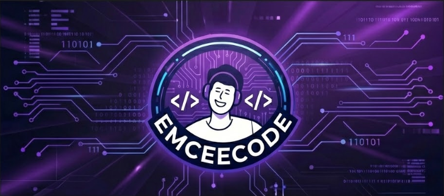

  

# ¡Hola! Soy Alejandro Rudas 👨‍💻

> **Full Stack Developer | Backend-Focused | Cloud-Oriented**

Desarrollador de software enfocado en la construcción de aplicaciones web robustas, escalables y bien estructuradas. Me especializo en arquitectura backend, diseño de APIs REST, autenticación segura y despliegue en entornos basados en contenedores.

Trabajo bajo principios de código limpio, separación por capas y buenas prácticas de ingeniería.

---

### 🚀 Tech Stack

  
  
  
  
  
  
  
  

 

#### 🧠 Lenguajes & Ecosistema

- **Frontend:** JavaScript, React, HTML5, CSS3, Bootstrap, TypeScript
- **Backend:** Node.js, Express, Java (Spring Boot)

#### 🗄️ Bases de Datos

- PostgreSQL, MySQL
- Modelado relacional y diseño optimizado de esquemas

#### ☁️ Infraestructura & DevOps

- Docker & Docker Compose _(Creación y orquestación de contenedores)_
- Despliegues en entornos Linux y configuración de servidores
- Arquitectura cliente-servidor

#### 🔐 Seguridad & Arquitectura

- Autenticación JWT y control de acceso basado en roles (RBAC)
- Arquitectura por capas (Controller, Service, Repository)
- Diseño de APIs RESTful con validaciones y manejo de errores estructurado

---

### 🛠️ Portafolio y Proyectos

Aquí puedes ver algunos de los desarrollos en los que he trabajado. Existen sistemas avanzados que actualmente se encuentran en desarrollo cerrado, pero que dan muestra de las arquitecturas backend con las que trabajo diariamente.

- **[🔹 Aplicación Web Full Stack (Card Game Project)](https://github.com/EmCeeBroo/gameCards)**  
  Simulación de entorno profesional aplicando diseño de base de datos, persistencia, seguridad y consumo de API desde el frontend. _(Repositorio Público)_

- **[🔹 Aprendiendo Docker Compose](https://github.com/EmCeeBroo/Aprendiendo-Docker-Compose)**  
  Material de capacitación interactivo que desarrollé y brindé para enseñar desde los fundamentos hasta la orquestación de contenedores en entornos de desarrollo usando Docker Compose. _(Repositorio Público)_

- **🔹 Sistema de Reservación (Renard)** `[🚧 En Construcción - Repositorio Privado]`  
  Aplicación full-stack para la gestión de reservas de restaurantes. Cuenta con arquitectura web moderna, autenticación segura y una administración centralizada. _(Código actualmente privado durante la fase de desarrollo)_

- **🔹 E-Commerce de Ropa** `[🚧 En Construcción - Repositorio Privado]`  
  Sistema completo de e-commerce con pasarela de autenticación JWT, arquitectura limpia, control de roles y separación estricta por capas siguiendo estándares profesionales orientados a escalabilidad. _(Código actualmente privado durante la fase de desarrollo)_

---

### 📈 Actualmente Enfocado En

- 🌱 Profundizando mis conocimientos en **Docker** para despliegues fluidos
- ⚙️ Optimización de rendimiento backend y consultas complejas de bases de datos
- 🏗️ Integración de buenas prácticas en la estructuración de proyectos Web

---

### 📫 Conectemos

Siempre estoy abierto a charlar sobre código, arquitectura en el lado del servidor o increíbles oportunidades de colaboración.

 

  

